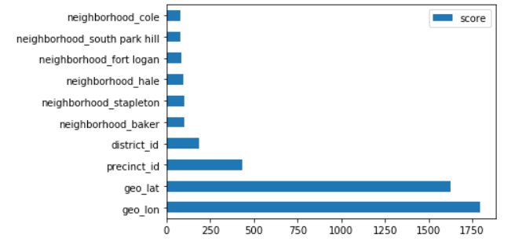
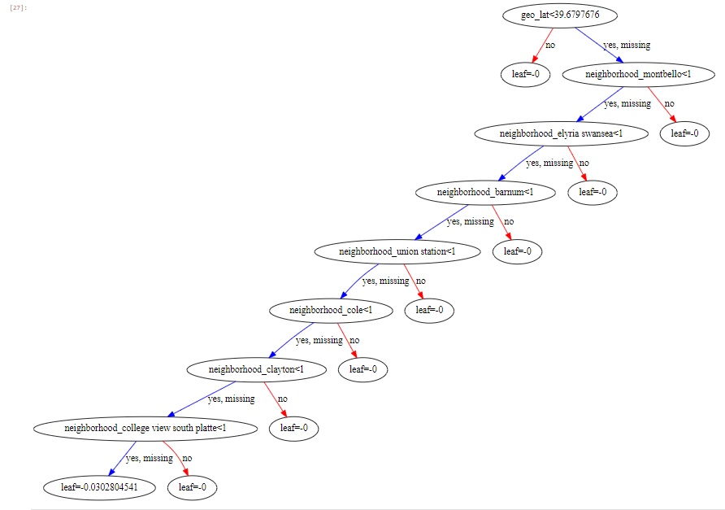

# Analysis of Crime Reports in the City and County of Denver

#### Chris Richards
#### Practicum 2, Summer 2020
#### Regis University

## Project Goal
The goal of this project was to analyze a collection of crime reports to predict the category of crime using various machine learning models.

## Data Science Task 	
Experiments with various algorithms will be performed to determine association rules related to crime in Denver and a machine learning classification model will be developed to predict crime categories.    

## Analysis
The crime reports will be examined using techniques of exploratory data analysis, cartographic visualizations of geographic data and time-series analysis to gain a better understanding of the dat set.  

## Data Overview
The data for this project comes from the City and County of Denver’s official government website: https://www.denvergov.org/opendata/dataset/city-and-county-of-denver-crime  
The crime reports cover a four and a half year time span starting January 1st, 2015 and continue up to July 2020.  
The data file on incidents of crime has 19 attributes and 371,189 observations.  
Features include:  

* INCIDENT_ID	
* OFFENSE_ID	
* OFFENSE_CODE	
* OFFENSE_CODE_EXTENSION	
* OFFENSE_TYPE_ID	
* OFFENSE_CATEGORY_ID	
* FIRST_OCCURRENCE_DATE	
* LAST_OCCURRENCE_DATE	
* REPORTED_DATE	
* INCIDENT_ADDRESS	
* GEO_X	
* GEO_Y	
* GEO_LON	
* GEO_LAT	
* DISTRICT_ID	
* PRECINCT_ID	
* NEIGHBORHOOD_ID	
* IS_CRIME	
* IS_TRAFFIC  

Additional data files were found on the city’s website related to police precincts and neighborhood demographics and socioeconomic factors.  The police precinct data consists of 23 rows with 14 features.  The neighborhood data contains 78 rows, one for each neighborhood, and 116 features.
The size of the data is adequate for this project and data collection took considerable effort given the difficulty in finding it but has been acquired.  

## Resources
* Anaconda 3
* Python 3
* Jupyter Notebooks  

## Libraries: 
* Pandas - data analysis and manipulation
* numpy - array processing
* geopandas - data analysis and manipulation of geodata
* folium - map creation
* sci-kit learn - modules for machine learning
* SweetViz - automated exploratory data analysis
* graphviz - displaying decision trees
* seaborn - data visualization library
* matplotlib - plotting
* xgboost - extreme gradient boosting module

## Data Cleaning
Extensive effort was needed for the data cleaning phase of this project.  A number of the features contained formatting and capitilization issues that would 
have caused issues later in the project.  Missing values were especially problematic.  In the case of the first occurrence date of crimes, many had values that defaulted
to January 1st of the year of the report.  It became clear that, based on the type of crime associated with this anomaly, that the first of the year was used
when the actual start date of the crime was unknown.  Many missing values existed in the location data as well.  After a bried analysis it became clear that the data was intentionally 
removed from the public data as the crimes were entirely sexual assault crimes.  In these cases, the police will not release the location or address of the crime in
order to protect the privacy rights of the victim.  

For these sexual assault reports the location data was added based on the police district in which the crime was reported.  Police district data was identified online and the address of the district's 
main police station was used as the location of the sexual assault.  Those addresses were then converted to latitude and longitude and added to the data.
  
Two of the features, "geo_x" and "geo_y", were deemed unnecessary as the latitude and longitude of the reported crime was included in the data.  Those redundant features 
were removed.  Additional features were removed as well, including the address, two report identifiers and problematic dates.  

The data set also included two features, "is_traffic" and "is_crime", that served as flags to indicate whether a crime was traffic related or not.  The data was filtered to include only crime
reports and the traffic reports were removed, along with the two flag features.  

Neighborhood data was located online from census data and merged with the existing crime reports by neighborhood.  Although the aggregation of this data with the existing crime data
was successful the resulting dataframe was very large and, ultimately, unusable given my current processing limitations.  

Detailed steps can be found in the practicum2_data_cleaning.ipynb notebook in this repository.

## Exploratory Data Analysis (EDA)
Typical EDA activities were performed including:
* Quantitative stats
* Checking for null values and mitigating
* Pairs plot for correlations
* The SweetViz library was used to generate a comprehensive EDA report
  
The incidence of crime, crime types, and seasonal variations of crime patterns were analysed.    
The number of crimes by police district was examined.  The plot show the districts ordered from least to most crimes.
District 6 has the most crimes with 84,753. District 7 has the least crimes at 4,348.

The number of crimes by neighborhoods in Denver was likewise analyzed.  
The neighborhood with the most crimes by far is Five Points with 22,663 crimes. The neighborhoods of the Central Business District, Stapleton, Capital Hill and Montbello form the next cluster of crime incidence and round out the top five neighborhoods for crime.

The frequency of crimes by type was plotted.  
The highest category of crimes is a catch-all category, "all other crimes". Unfortunately, the Denver Police Department does not provide a breakdown of this category making it difficult to extract any meaningful information.

The second and thrid highest categories are a near tie at around 51,000 incidents are "public disorder" and "larceny", respectively. Theft from vehicles and drug and alcohol offenses round out the top five.

Once the neighborhood with the most crime reports was identified the frequency of crime types in that neighborhood was examined.  

The pattern of crime category in Five Points is similar to the larger trend city wide. "All Other Crimes" are the top category followed, in this case, by drug and alcohol crimes. This is different than the city wide trend where drug and alcohol related crimes are the fifth most frequent type.

### Time-series analysis
A time-series analysis based on the reported date of a crime was performed.  The report dates were analyzed across years, months and days with the years
months time-frame providing a clear pattern in crime.  

The plot of crime frequency by month shows a seasonal trend in the occurrence of crime. The winter months have a lower incidence of crime while the summer months show a significant rise in crime. Summer 2017 was a high-point for crime in Denver.

A crime type, car thefts, was selected for further analysis.  The month with the most frequent car thefts was analyzed.  

The months of May and June are the highest in terms of car thefts. February has the lowest incidence of car thefts.

The top 20 neighborhoods with the most car thefts were identified.

The number one neighborhood for car thefts is Stapleton, followed closely by Gateway/Green Valley Ranch. The lowest occurrence of car thefts is in the Central Business District, Speer, Valverde, and North Capitl Hill neighborhoods.  
  
### Geographical Analysis
The crime data from the Denver Police Department contains a number of location-based features. The location, in latitude and longitude, of reported crimes was used for a geographic analysis of the data.
The frequency of crimes across Denver's neighborhoods was mapped.  In addition, the location of each crime report in the data was mapped with additional information from the report included with the marker.  Both maps utilized Google maps as the underlying
base layer with data from the crime reports overlayed.  Additional neighborhood data was identified and incorporated for mapping the neighborhood boundaries.  

The folium library along with geopandas were used for manipulating the geodata and for creating the map objects.  The maps are available in the repo as interactive HTML pages.  

#### Chloropleth Map of Crime by Neighborhood
This map shows the frequency of crimes by neighborhood since 2015.  Neighborhoods with lower crime are shaded light yellow while high crime neighborhoods trend towards red.  The neighborhood of Five Points has the highest incidence of crime and is clearly visible marked in red.

#### Map of Crime Reports (1000 Reports)
This map shows individual crime reports marked by their location.  It is zoomed in to an area slightly south-east of the Denver city center, centered on City Hall.  A marker has been selected to show the additional information available to a user.  

 Detailed steps can be found in the practicum2_eda.ipynb notebook in this repository.
 
   
 ## Model: Support Vector Machine Classifier (SVC)
 The first model built for predicting crime categories was a Support Vector Machine using the sci-kit learn library.  The task for the SVC was to perform a multi-class classification of the data to train the model.  The Denver Police Department organizes crime reports in to 15 categories.  
 
 Those categories are:
 - Aggravated Assault
 - Arson
 - Auto Theft
 - Burglary
 - Drug / Alcohol
 - Larceny
 - Murder
 - Other Crimes Against Persons
 - Public Disorder
 - Robbery
 - Sexual Assault
 - Theft from Motor Vehicle
 - Traffic Accident
 - White Collar Crime
 - All Other Crimes
 
 This model utilized the Radial Basis Function kernel which is widely used in classification as it is capable of extending the kernel through infinite dimensions.  Default paramters were utilized.  The model was trained using 70% of the data.  A validation set consisting of the remaining 30% was held back.  Accuracy was selected as the scoring metric.  
 
 The model's accuracy was 29.43% which is very low.  
   
 Next, several other SVM classifiers were trained using different kernels and parameters.  The models were:
 
 - An SVC using the linear kernel
 - A LinearSVC
 - An SVC using the RBF kernel
 - An SVC using the Poly kernel
 
 
Data used for the model building was divided with 70% used for training and the remaining 30% for testing.  The models were then fitted using the training data set and predictions made on the test data set.  Accuracy using the R2 scoring metric was recorded.  

Detailed steps can be found in the following notebook in this repository:  
* practicum2_svm3.ipynb

## Model: GridsearchCV (XGBoost)
The second model building approach utilized the GridsearchCV method and the XGBoost algorithim for classification.  GridsearchCV allows the user to specify a set, or "grid", of hyperparameters to use for model building.  It then exhaustively iterates through each combination of the hyperparameters as it fits each model.  The models are scored using the accuracy metric and the best performing set of parameters is recorded.  Furthermore, it performs cross-validation of the data as it divides it into testing and training sets.  

The XGBoost algorithm is capable of both classification and regression modeling.  This project implemented it as a classifier.  XGBoost uses decision trees to arrive at predictions.  The trees are "boosted" in that the algorithm seeks to improve on earlier trees by learning from their mistakes.  

A 70/30 train-test split was once again used to divide the data for model building and validation.  A list of parameters was constructed and passed to the GridSearchCV algorithim to itierate across.  Cross-validation was performed with k=5 folds.  

Unfortunately, the size of the data set caused critical issues with the hardware and environment used for this project.  Multiple attempts to complete model building of the GridSearchCV algorithim ended in failure with operating system errors, insufficient memory and loss of connection between the Jupyter Notebook environment and the local server used for processing.  

A successful run was achieved using only 1% of the data and configuring the algorithm to utilize additional resources on the GPU and to allow for early-stopping of training when no gain was seen in the model.  This lead to poor results seen in the model's accuracy with the training and validation set.  

Accuracy was 33.29% for training and 28.01% for testing.  

Feature importance and the best estimator tree were plotted and analyzed.  Due to the number of features the top 10 most important features were plotted.  

  

The plot shows that the two most important features were latitude and longitude.  Police precinct and police district were the next two most important features, although considerably lower than the latitude and longitude features.  Various neighborhoods round out the remainder of the features.  

Next, the graphviz library was used to plot the decision tree derived from the best estimator model.

  
Detailed steps for the GridSearchCV modeling can be found in the following notebook in this repository:
* practicum2_gridserchcv_xgboost_models_4.ipynb

## Results
In this project Denver crime reports from January 2015 to July 2020 were analyzed and preprocessed for use in various predictive models.  The crime and census data were publicly available.  Data cleaning was extensive with many issues to resolve, such as missing values, conversion of data types and manipulation of poorly formatted neighborhood information.  Categorical data was present in large quantities and was encoded using dummy variables.  The data was intitially explored using various Exploratory Data Analysis techniques.  Time-series and geographic analysis were also performed.  Trends in crime including seasonality, frequency of crimes and areas of the most crime were discovered and visualalized.  

The data was then used to train various predictive models in an effort to classify crime types.  Two classification algorithms, Support Vector Classifier and XGBoost, were utilized in the model building.  In addition, the GridSearchCV method of hyperparameter tuning and cross-validation was used in conjunction with XGBoost in an effort to optimize model performance and quality.  

Results unfortunately were poor in regards to the accuracy of the models.  Due to processing constraints the neighborhood census data was removed in order to shrink the number of features the models were given.  Likewise, the number of observations was reduced by 99% in order to successfully complete the exhaustive GridSearchCV algorithm.  Further research into the GridSearchCV and XGBoost algorithms uncovered several parameters that lowered the processing burden.  

The XGBoost models were configured to use all hardware resources to enhance processing.  Also, early stopping was added as a parameter in order to end model training if no further gains were found.  Lastly, XGBoost provides users the ability to shift processing to the GPU for additional processing power.  These settings were implemented for later rounds of training.

Although gains in performance were seen the amount of data was still too much for the current hardware to successfully complete model building.  Many fatal errors occurred at various times, including critical Windows OS errors, and loss of connectivity between the Jupyter Notebook environment and the local processing server.  

It is difficult to draw conclusions regarding the use of machine learning models to predict types of crime due to the hardware and environment issues experienced in this project.  Training the models was very difficult due to the resource limitations of my hardware and environment.  The performance of the models would likely be increased by training on a larger dataset, however.  Furthermore, adding the features from the neighborhood census data would likely improve model accuracy.  
  

