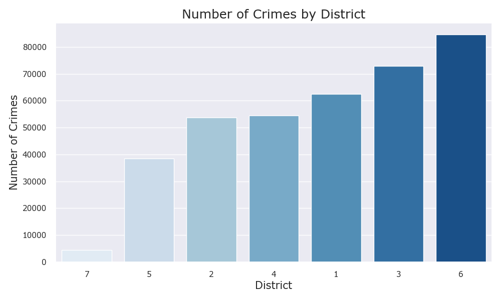
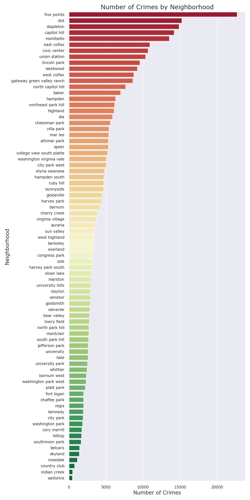
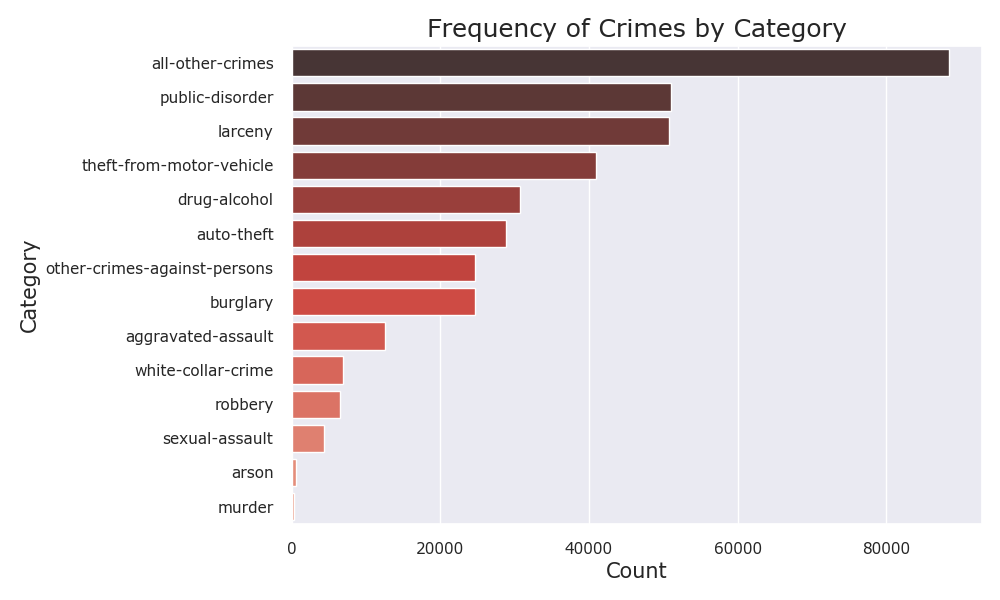
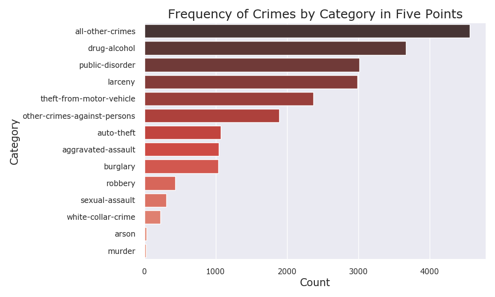
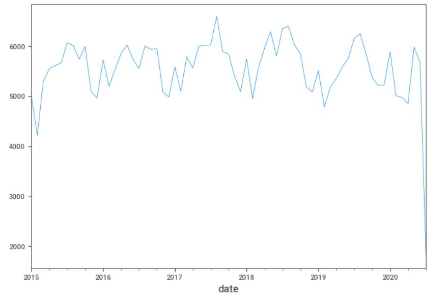
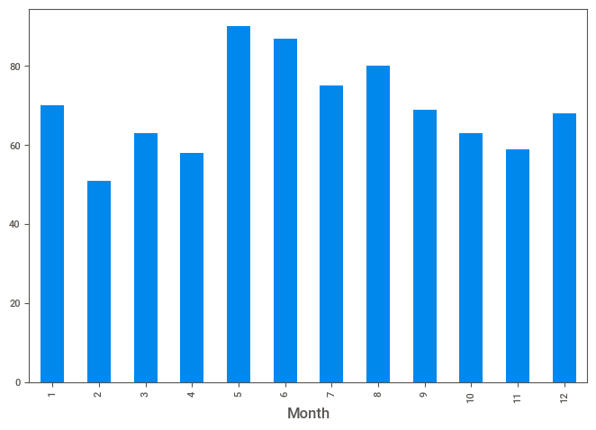
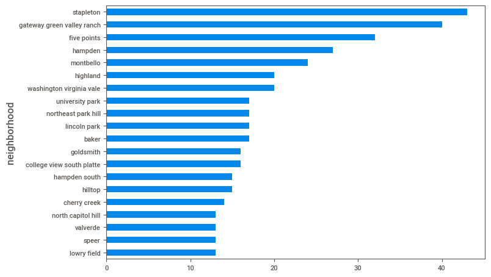
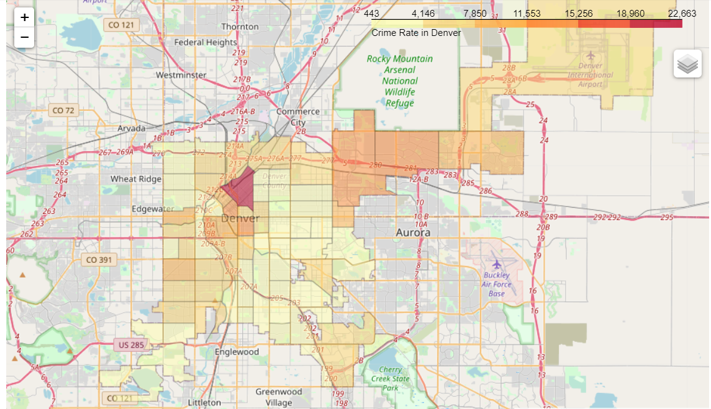
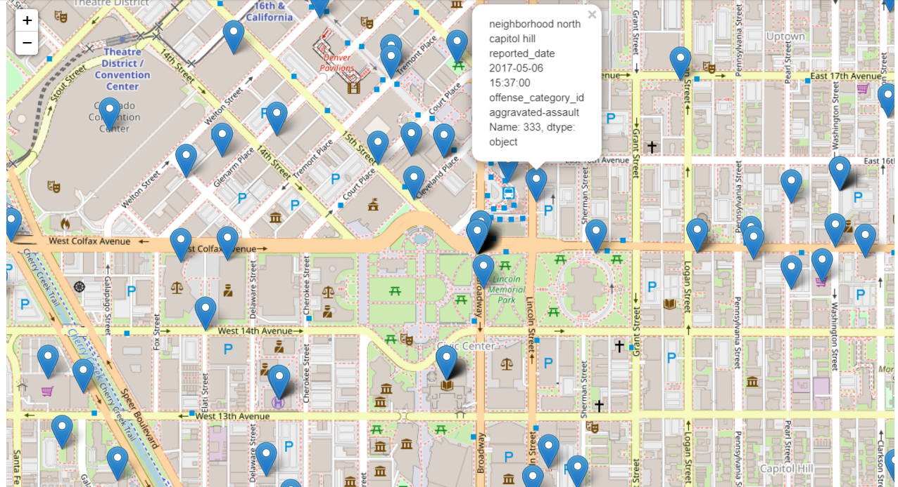

# Analysis of Crime Reports in the City and County of Denver

#### Chris Richards
#### Practicum 2, Summer 2020
#### Regis University

## Project Goal
The goal of this project was to analyze a collection of crime reports to predict the category of crime using various machine learning models.

## Data Science Task 	
Analysis of the data including EDA, cartographic visualizations and cluster analysis of reports.  Experiments with various algorithms will be performed to determine association rules related to crime in Denver and a machine learning classification model will be developed to predict crime categories.

## Analysis
The data will initially be assessed using typical EDA techniques, including time-series analysis.  The geographic features will be used to perform visualizations to better understand the data.  

## Data Overview
The data for this project comes from the City and County of Denver’s official government website: https://www.denvergov.org/opendata/dataset/city-and-county-of-denver-crime  
The crime reports cover a four and a half year time span starting January 1st, 2015 and continue up to July 2020.  
The data file on incidents of crime has 19 attributes and 371,189 observations.  
Features include:  

* INCIDENT_ID	
* OFFENSE_ID	
* OFFENSE_CODE	
* OFFENSE_CODE_EXTENSION	
* OFFENSE_TYPE_ID	
* OFFENSE_CATEGORY_ID	
* FIRST_OCCURRENCE_DATE	
* LAST_OCCURRENCE_DATE	
* REPORTED_DATE	
* INCIDENT_ADDRESS	
* GEO_X	
* GEO_Y	
* GEO_LON	
* GEO_LAT	
* DISTRICT_ID	
* PRECINCT_ID	
* NEIGHBORHOOD_ID	
* IS_CRIME	
* IS_TRAFFIC  

Additional data files were found on the city’s website related to police precincts and neighborhood demographics and socioeconomic factors.  The police precinct data consists of 23 rows with 14 features.  The neighborhood data contains 78 rows, one for each neighborhood, and 116 features.
The size of the data is adequate for this project and data collection took considerable effort given the difficulty in finding it but has been acquired.  

## Resources
* Anaconda 3
* Python 3
* Jupyter Notebooks  

## Libraries: 
* Pandas - data analysis and manipulation
* numpy - array processing
* geopandas - data analysis and manipulation of geodata
* folium - map creation
* sci-kit learn - modules for machine learning
* SweetViz - automated exploratory data analysis
* graphviz - displaying decision trees
* seaborn - data visualization library
* matplotlib - plotting
* xgboost - extreme gradient boosting module

## Data Cleaning
Extensive effort was needed for the data cleaning phase of this project.  A number of the features contained formatting and capitilization issues that would 
have caused issues later in the project.  Missing values were especially problematic.  In the case of the first occurrence date of crimes, many had values that defaulted
to January 1st of the year of the report.  It became clear that, based on the type of crime associated with this anomaly, that the first of the year was used
when the actual start date of the crime was unknown.  Many missing values existed in the location data as well.  After a bried analysis it became clear that the data was intentionally 
removed from the public data as the crimes were entirely sexual assault crimes.  In these cases, the police will not release the location or address of the crime in
order to protect the privacy rights of the victim.  

For these sexual assault reports the location data was added based on the police district in which the crime was reported.  Police district data was identified online and the address of the district's 
main police station was used as the location of the sexual assault.  Those addresses were then converted to latitude and longitude and added to the data.
  
Two of the features, "geo_x" and "geo_y", were deemed redundant and unnecessary as the latitude and longitude of the crime was included in the data.  Those redundant features 
were removed.  Additional features were removed as well, including the address, two report identifiers and problematic dates.  

The data set also included two features, "is_traffic" and "is_crime", that served as flags to indicate whether a crime was traffic related or not.  The data was filtered to include only crime
reports and the traffic reports were removed, along with the two flag features.  

Neighborhood data was located online from census data and merged with the existing crime reports by neighborhood.  Although the aggregation of this data with the existing crime data
was successful the resulting dataframe was very large and, ultimately, unusable given my current processing limitations.  
  

## Exploratory Data Analysis (EDA)
Typical EDA activities were performed including:
* Quantitative stats
* Checking for null values and mitigating
* Pairs plot for correlations
* The SweetViz library was used to generate a comprehensive EDA report
  
The incidence of crime, crime types, and seasonal variations of crime patterns were analysed.    
The number of crimes by police district was examined.  The plot show the districts ordered from least to most crimes.
District 6 has the most crimes with 84,753. District 7 has the least crimes at 4,348.

The number of crimes by neighborhood's in Denver was likewise analyzed.  
The neighborhood with the most crimes by far is Five Points with 22,663 crimes. The neighborhoods of the Central Business District, Stapleton, Capital Hill and Montbello form the next cluster of crime incidence and round out the top five neighborhoods for crime.

The frequency of crimes by type was plotted.  
The highest category of crimes is a catch-all category, "all other crimes". Unfortunately, the Denver Police Department does not provide a breakdown of this category making it difficult to extract any meaningful information.

The second and thrid highest categories are a near tie at around 51,000 incidneces are "public disorder" and "larceny", respectively. Theft from vehicles and drug and alcohol offenses round out the top five.

Once the neighborhood with the most crime reports was identified the frequency of crime types in that neighborhood was examined.  

The pattern of crime category in Five Points is similar to the larger trend city wide. "All Other Crimes" are the top category followed, in this case, by drug and alcohol crimes. This is different than the city wide trend where drug and alcohol related crimes are the fifth most frequent type.

### Time-series analysis
A time-series analysis based on the reported date of a crime was performed.  The report dates were analyzed across years, months and days with the years
months time-frame providing a clear pattern in crime.  

The plot of crime frequency by month shows a seasonal trend in the occurrence of crime. The winter months have a lower incidence of crime while the summer months show a significant rise in crime. Summer 2017 was a high-point for crime in Denver.

A crime type, car thefts, was selected for further analysis.  The month with the most frequent car thefts was analyzed.  

The months of May and June are the highest in terms of car thefts. February has the lowest incidence of car thefts.

The top 20 neighborhoods with the most car thefts were identified.

The number one neighborhood for car thefts is Stapleton, followed closely by Gateway/Green Valley Ranch. The lowest occurrence of car thefts is in the Central Business District, Speer, Valverde, and North Capitl Hill neighborhoods.  
  
### Geographical Analysis
The crime data from the Denver Police Department contains a number of location-based features. The location, in latitude and longitude, of reported crimes was used for a geographic analysis of the data.
The frequency of crimes across Denver's neighborhoods was mapped.  In addition, the location of each crime report in the data was mapped with additional information from the report included with the marker.  Both maps utilized Google maps as the underlying
base layer with data from the crime reports overlayed.  Additional neighborhood data was identified and incorporated for mapping the neighborhood boundaries.  

The folium library along with geopandas were used for manipulating the geodata and for creating the map objects.  The maps are available in the repo as interactive HTML pages.  

#### Chloropleth Map of Crime by Neighborhood
This map shows the frequency of crimes by neighborhood since 2015.  Neighborhoods with lower crime are shaded light yellow while high crime neighborhoods trend towards red.  The neighborhood of Five Points has the highest incidence of crime and is clearly visible marked in red.

#### Map of Crime Reports (1000 Reports)
This map shows individual crime reports marked by their location.  It is zoomed in to an area slightly south-east of the Denver city center.  A marker has been selected to show the additional information available to a user.  

 Detailed steps can be found in the practicum2_eda.ipynb notebook in this repository.
 
 ## Feature Engineering
 Feature engineering was light.  An extraneous index column was removed from the initial data set.  Categorical features were encoded using different techniques.  
 
 Features that were poorly correlated with the target variable, "charges", were removed and saved for later model building.  
 
 An additional feature, "weight category", based on the BMI categories was added as part of the EDA process.  The categories were used for analysis of the relationship between BMI categories and several other features, including "charges".  Visualizations of the analysis can be found in the EDA notebook.
 
 Detailed feature engineering steps can be found in the practicum_feature_engineering_2.ipynb notebook in this repository.  
   
 ## Models: Linear Regression and Support Vector Regression (SVR)
 The first attempts at model building for this project were performed using regression models from several libraries.  
 The models were:  
* Linear regression model (scikit-learn)
* Polynomial Regression model using SVR (scikit-learn)
* Linear regression model (statsmodels)

Data used for the model building was divided with 70% used for training and the remaining 30% for testing.  The models were then fitted using the training data set and predictions made on the test data set.  Accuracy using the R2 scoring metric was recorded.  

Each of the models was fit using data containing different features.  One set of data consisted of the complete feature set, another set contained only "age" and "smoker", while the third set added "bmi" to "age" and "smoker".

In addition, feature importance based on each model was visualized.  

Detailed steps can be found in the following notebooks in this repository:  
* practicum_linear_regression_all_features_2.ipynb
* practicum_linear_regression_age_and_smoker_2.ipynb
* practicum_linear_regression_age_bmi_smoker_2.ipynb

## Models: XGBoost
The extreme gradient boosting (XGBoost) algorithm was implemented for the second round of model building.  The XGBoost algorithm is capable of both classification and regression modeling.  This project implemented it as a regressor similar to the earlier linear and polynomial regression experiments.  Unlike the earlier models, XGBoost uses decision trees to arrive at predictions.  The trees are "boosted" in that the algorithm seeks to improve on earlier trees by learning from their mistakes.  
  
Two XGBoost models were implemented.  The first used a set of parameters of low values as a "baseline".  The second model's hyperparameters were tuned for optimizing the accuracy scoring metric.  In addition, the final boosted tree of each model was visualized.

Data for these models followed the earlier 70/30 split of testing and training sets.  The complete set of features was used for both models.
  
Detailed steps can be found in the practicum_xgboost_models_1_and_2.ipynb notebook in this repository.  
## Models:  GridsearchCV (XGBoost)
The third set of model building experiments utilized the GridsearchCV method.  GridsearchCV allows the user to specify a set, or "grid", of hyperparameters to use for model building.  It then iterates through each combination of the hyperparameters as it fits each model.  The models are scored using, in this project, the R2 accuracy metric and the best performing set of parameters is recorded.  Furthermore, it performs cross-validation of the data as it divides it into testing and training sets.  
  
Two experiments using the GridsearchCV method were performed with the XGBoost algorithm as the estimator.  The goal was to use GridsearchCV to automatically find the best parameters to use for the prediction model.  

One of the experiments was fit using the 70% training set while the other used the entire set of data.  The complete set of features was used for both models.  

The resulting best parameters and best estimator from each of the experiments was recorded.   The best estimator objects were then used to perform predictions and the accuracies were recorded.  

Feature importance and the final boosted trees were again visualized.  
  
Detailed steps can be found in the following notebooks in this repository:
* practicum_gridserchcv_xgboost_models_1.ipynb
* practicum_gridserchcv_xgboost_models_full_data.ipynb

## Results
The results for each of the models was recorded and analyzed.  

  
The top-ranked model, XGBoost using the training data set and improved hyperparameters, logged a 99.99% accuracy score.   While this should be cause for celebration, it is very likely that this model is overfitted to the data and would perform poorly when predicting on new data.  The process of manually adjusting the hyperparameters to increase the accuracy score likely inadvertently caused the overfitting.  In particular, the depth of the tree at 13 levels is very deep, which is known to cause overfitting.  
  
The second highest model was found using GridsearchCV and trained on the full data set.  It scored a respectable 86.00%.  This model was fit using 10-fold cross-validation which should minimize overfitting.  This method found the best estimator needed only a three-level boosted tree in order to arrive at its predictions.  
  
Future enhancements to this project could include experiments with additional predictive models such as Generalized Linear Models (GLM) or random forests.  Improved accuracy of the linear regression models is likely with additional preprocessing of the data to better conform to the assumptions of linear modeling.  
  

